---

# brain — API de Procesamiento de Documentos (FastAPI + Vertex AI + Google Docs)

> Orquesta: **Docs/PDF → Gemini → Doc de salida**. Desplegable en **Cloud Run**.

---

# 📦 Características

* **Endpoints**

  * `POST /process` → *Input:* **Google Doc** (por ID)
  * `POST /process-pdf` → *Input:* **PDF** (Drive o `gs://`) con *map-reduce* opcional
* **Clientes centralizados con caché** (Drive, Docs, Vertex) + **reintentos robustos** (TLS/EOF/5xx/cuotas)
* **Soporte ADC/SA JSON** (local y Cloud Run) con scopes mínimos Workspace
* **Logs estructurados** y errores claros
* **Configuración por entorno** vía `.env` / variables de entorno
* **Chunking** seguro para Google Docs (evita `endIndex` newline) y **streaming** de Vertex para progreso

---

## 🗂️ Estructura del repo

```
brain/
├── src/
│   ├── api/
│   │   └── routes.py
│   ├── clients/
│   │   ├── drive_client.py
│   │   ├── gdocs_client.py
│   │   └── vertex_client.py
│   ├── domain/
│   │   └── schemas.py
│   ├── services/
│   │   ├── processing.py
│   │   └── pdf_processing.py
│   ├── utils/
│   │   └── logger.py
│   ├── auth.py
│   ├── main.py
│   └── settings.py
├── tests/  # pruebas unitarias rápidas (Drive/GCS/Vertex/Docs)
│   ├── assert_access.py
│   ├── drive_download.py
│   ├── gcs_upload.py
│   ├── vertex_text.py
│   ├── vertex_with_file.py
│   ├── docs_read.py
│   ├── docs_write_small.py
│   ├── docs_write_big.py
│   └── docs_write_stress.py
├── requirements.txt
└── Dockerfile
```

---

## 🧠 Arquitectura

### 1) Flujo /process (Docs → Gemini → Doc)


### 2) Flujo /process-pdf (PDF → Gemini → Doc)

```mermaid
sequenceDiagram
  autonumber
  participant C as Cliente
  participant API as FastAPI (/process-pdf)
  participant DR as Drive API (descarga opcional)
  participant GCS as Cloud Storage (staging opcional)
  participant V as Vertex AI (Gemini)
  participant GO as Google Docs (salida)

  C->>API: POST /process-pdf {system, base, pdf_url|drive_file_id, params}
  alt pdf_url = drive / drive_file_id
    API->>DR: files.get + media (opcional)
    API->>GCS: upload (gs://bucket/uploads/...)
  else pdf_url = gs://...
    Note over API,V: se usa directo
  end
  par si PDF > N páginas
    API->>V: generate_content(stream) con chunk 1..k (map)
  and
    API->>V: reduce de resúmenes parciales
  end
  API->>GO: batchUpdate(output_doc, delete+insert en chunks)
  API-->>C: {status, output_doc_link}
```



---

## 🔧 Configuración

### Variables de entorno (`.env` o Cloud Run)

| Variable                                | Ejemplo / Default                   | Descripción                                               |
| --------------------------------------- | ----------------------------------- | --------------------------------------------------------- |
| `ENVIRONMENT`                           | `local` / `run`                     | Comportamiento de logs y clientes                         |
| `LOG_LEVEL`                             | `INFO`                              | Nivel de logging                                          |
| `GCP_PROJECT_ID`                        | `ortega-473114`                     | Proyecto GCP                                              |
| `GCP_LOCATION`                          | `us-central1`                       | Región Vertex/Run                                         |
| `SA_EMAIL`                              | `gctest@...iam.gserviceaccount.com` | SA para grants opcionales                                 |
| `GOOGLE_APPLICATION_CREDENTIALS`        | `/secrets/sa.json` *(local)*        | Ruta a SA JSON *(local)*                                  |
| `VERTEX_MODEL_ID`                       | `gemini-2.5-flash`                  | Modelo por defecto                                        |
| `SHARED_FOLDER_ID`                      | *(opcional)*                        | Carpeta compartida (Workspace)                            |
| **`PDF_STAGING_BUCKET`**                | `my-bucket-out`                     | **Bucket GCS** para staging de PDFs                       |
| **`PDF_MAX_PAGES_PER_CHUNK`**           | `60`                                | Páginas por chunk (map)                                   |
| **`PDF_USE_FILE_API`**                  | `true` / `false`                    | `true` registra en Files API; `false` usa `gs://` directo |
| *(opcional)* `DOCS_TEXT_CHUNK`          | `50000`                             | Tamaño de chunk de escritura a Docs                       |
| *(opcional)* `DOCS_TEXT_CHUNK_SLEEP_MS` | `150`                               | Pausa (ms) entre chunks de escritura                      |

### Creación de bucket e IAM (una vez)

```bash
gcloud services enable storage.googleapis.com

# 1) Crear bucket (¡sin sufijos tipo /pdf!)
gcloud storage buckets create gs://my-bucket-out \
  --project=ortega-473114 --location=us-central1 --uniform-bucket-level-access

# 2) Conceder al servicio que corre la API (SA del servicio)
gcloud storage buckets add-iam-policy-binding gs://my-bucket-out \
  --member=serviceAccount:gctest@ortega-473114.iam.gserviceaccount.com \
  --role=roles/storage.objectCreator
gcloud storage buckets add-iam-policy-binding gs://my-bucket-out \
  --member=serviceAccount:gctest@ortega-473114.iam.gserviceaccount.com \
  --role=roles/storage.objectViewer

# 3) (Recomendado) permitir lectura al Vertex Service Agent si usas gs:// directo
PROJECT_NUMBER=$(gcloud projects describe ortega-473114 --format='value(projectNumber)')
gcloud storage buckets add-iam-policy-binding gs://my-bucket-out \
  --member=serviceAccount:service-${PROJECT_NUMBER}@gcp-sa-aiplatform.iam.gserviceaccount.com \
  --role=roles/storage.objectViewer
```

---

## ▶️ Ejecución local

1. Instalar dependencias

```bash
pip install -r requirements.txt
```

2. Autenticación

* **ADC**: `gcloud auth application-default login`
* **SA JSON**: `export GOOGLE_APPLICATION_CREDENTIALS=/ruta/sa.json`

3. Levantar

```bash
uvicorn src.main:app --reload --port 8080
```

---

## 📡 Endpoints

### `POST /process`

**Body (JSON)**

```json
{
  "system_instructions_doc_id": "DOC_ID",
  "base_prompt_doc_id": "DOC_ID",
  "input_doc_id": "DOC_ID",
  "output_doc_id": "DOC_ID",
  "additional_params": { "modo": "resumen_bullets" }
}
```

**Respuesta (200)**

```json
{
  "status": "success",
  "message": "El resultado de la IA fue escrito correctamente en el documento.",
  "output_doc_link": "https://docs.google.com/document/d/<OUTPUT_ID>/edit"
}
```

### `POST /process-pdf`

**Body (JSON)**

```json
{
  "system_instructions_doc_id": "DOC_ID",
  "base_prompt_doc_id": "DOC_ID",
  "pdf_url": "https://drive.google.com/file/d/<FILE_ID>/view?usp=sharing",
  "drive_file_id": "FILE_ID (opcional, acelera acceso)",
  "output_doc_id": "DOC_ID",
  "additional_params": {
    "objetivo": "responder preguntas de regreso",
    "formato_salida": "bullets",
    "max_bullets": 6,
    "tono": "ejecutivo"
  }
}
```

> También puedes pasar `pdf_url` como `gs://my-bucket-out/uploads/2025/10/31/archivo.pdf` si ya lo subiste.

**Respuesta (200)**

```json
{
  "status": "success",
  "message": "El resultado de la IA fue escrito correctamente en el documento.",
  "output_doc_link": "https://docs.google.com/document/d/<OUTPUT_ID>/edit"
}
```

**Ejemplo `curl` (Cloud Run)**

```bash
curl -i -X POST "https://<SERVICE>.run.app/process-pdf" \
  -H "Content-Type: application/json" \
  -d '{
    "system_instructions_doc_id": "1WLo-...5ERY",
    "base_prompt_doc_id": "1t024Ow48Z60...mswOw",
    "pdf_url": "https://drive.google.com/file/d/16SQKPpAQiw2-sWQAqXw_-4ZyigE0OdSn/view?usp=sharing",
    "drive_file_id": "16SQKPpAQiw2-sWQAqXw_-4ZyigE0OdSn",
    "output_doc_id": "1-jESPLbKj2j_J7NGDT5UXtET40W2-idhCNcKm2WcuCs",
    "additional_params": { "objetivo":"responder preguntas de regreso", "formato_salida":"bullets" }
  }'
```

---

## 🚀 Despliegue en Cloud Run

### Build & Deploy

```bash
gcloud builds submit --tag us-central1-docker.pkg.dev/PROJECT_ID/ai/brain:latest

gcloud run deploy brain \
  --image us-central1-docker.pkg.dev/PROJECT_ID/ai/brain:latest \
  --service-account=SA_EMAIL \
  --region=us-central1 --platform=managed --allow-unauthenticated \
  --memory=1Gi --cpu=1 --concurrency=60 --timeout=720 \
  --min-instances=0 --max-instances=20 \
  --set-env-vars="ENVIRONMENT=run,LOG_LEVEL=INFO,GCP_PROJECT_ID=PROJECT_ID,GCP_LOCATION=us-central1,VERTEX_MODEL_ID=gemini-2.5-flash,SA_EMAIL=SA_EMAIL,PDF_STAGING_BUCKET=my-bucket-out,PDF_MAX_PAGES_PER_CHUNK=60,PDF_USE_FILE_API=true"
```

> Ajusta `--timeout` según el tamaño de PDFs (recomendado 600–900s para procesos largos).

---

## ✅ Pruebas rápidas (CLI)

```bash
python -m tests.assert_access --file-id <FILE_ID> --mode drive
python -m tests.drive_download --file-id <FILE_ID>
python -m tests.gcs_upload
python -m tests.vertex_text
python -m tests.vertex_with_file
python -m tests.docs_read --doc-id <DOC_ID>
python -m tests.docs_write_small --doc-id <DOC_ID>
python -m tests.docs_write_big --doc-id <DOC_ID> --mb 0.2
python -m tests.docs_write_stress --doc-id <DOC_ID> --runs 5
```

---

## 🔐 Seguridad & permisos

* Scopes mínimos: `drive`, `documents`, `spreadsheets`, `cloud-platform`
* Comparte los Docs/Carpetas con la **Service Account** del servicio
* GCS: `roles/storage.objectCreator` + `roles/storage.objectViewer` para tu **SA**
  y `roles/storage.objectViewer` para el **Vertex Service Agent** (lectura `gs://`)

> **Tip**: Evita exponer `sa.json`. Usa Secret Manager o ADC en Cloud Run.

---

## 🧩 Troubleshooting (casos reales)

* **`400 Invalid deleteContentRange: The range cannot include the newline…`**
  → Al borrar contenido de un Doc, usa `endIndex-1` (evita borrar el newline del segmento raíz).

* **`EOF occurred in violation of protocol (_ssl.c:2427)` / `IncompleteRead`**
  → Retries con `ssl.SSLError`, `socket.timeout` y `HttpError 5xx/429/403 rateLimit*`,
  timeout de `AuthorizedHttp` **180s**, CA de **certifi**, chunk de escritura **50k** + `sleep(150ms)`.

* **`403/404 Drive` pese a compartir**
  → Si es PDF, valida con Drive API (`files.get`) y **usa el ID del original** (no de un shortcut).
  Confirma que el **bucket** y **Docs** tengan sharing a la **SA** correcta.

* **Procesos de 4–6 min en PDFs grandes**
  → Usa `PDF_MAX_PAGES_PER_CHUNK=30–60`, `PDF_USE_FILE_API=false` para `gs://` directo,
  y aumenta `--timeout` del servicio (600–900s).

---

## ✨ Notas de implementación

* Vertex se inicializa con las **mismas credenciales** que Drive/Docs (`AuthorizedHttp` + `ADC/SA`).
* `gdocs_client` escribe en **chunks** y reintenta en **TLS/EOF/5xx/cuotas**.
* `routes.py` retorna **JSON explícito** (evita cuerpos vacíos por validación del modelo).
* El warning del SDK de Vertex (deprecación 2025) sugiere migrar a la **nueva API de respuestas**; planificar cambio gradual.

---
